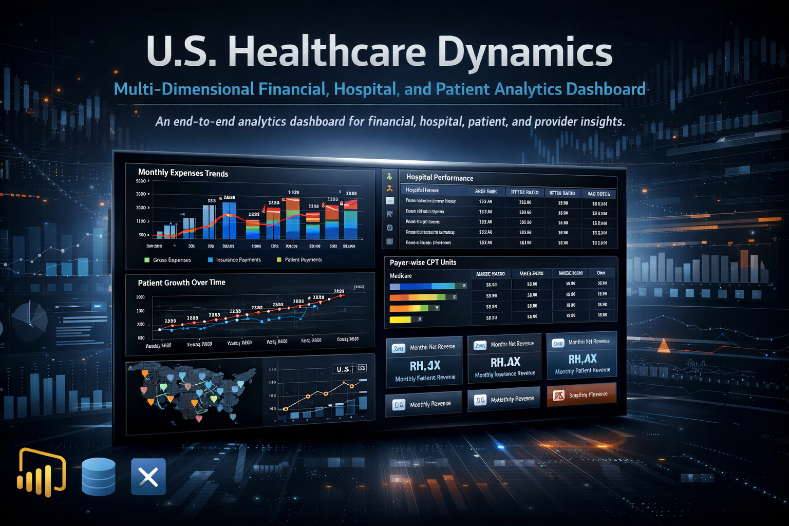

# U.S. Healthcare Dynamics: Multi-Dimensional Financial, Hospital, and Patient Analytics Dashboard

An end-to-end Power BI analytics dashboard that consolidates financial, hospital, patient, and provider data to uncover actionable insights across the U.S. healthcare ecosystem.

---

## 📌 Project Overview

**U.S. Healthcare Dynamics** is an interactive Power BI analytics project designed to analyze and visualize key dimensions of the U.S. healthcare system. The dashboard integrates financial performance, hospital efficiency, patient demographics, and payer–provider relationships to deliver actionable, data-driven insights for strategic decision-making.

The solution follows a narrative-driven Business Intelligence approach, enabling users to explore complex healthcare datasets through intuitive visuals, KPIs, drill-downs, and dynamic filters. The project demonstrates practical application of data modeling, KPI design, and analytical storytelling in a real-world healthcare analytics context.

---

## 🎯 Objective

The objective of this project is to transform complex and fragmented healthcare data into clear, meaningful insights that help stakeholders:

- Understand cost drivers and revenue trends  
- Evaluate hospital operational performance  
- Analyze patient demographics and outcomes  
- Assess payer reimbursement patterns and provider distribution  

---

## 🗂️ Dashboard Structure

The Power BI solution is organized into the following analytical views:

### 1️⃣ Executive Summary
- High-level KPIs covering patients, expenses, revenue, and procedure volumes  
- Monthly trends for expenses, payments, and patient growth  
- Snapshot view of overall healthcare system performance  

### 2️⃣ Hospital Performance
- Accounts Receivable (AR), IPTP Ratio, and ARGE Ratio analysis  
- Hospital-wise deficit and bad debt evaluation  
- CPT unit distribution across hospitals  
- Identification of hospitals requiring operational attention  

### 3️⃣ Patient Analysis
- Patient demographics by age, gender, blood group, and geography  
- Lifestyle indicators (diet, exercise, alcohol, tobacco)  
- Geographic distribution across states, cities, and regions  
- Outcome-focused insights to understand patient behavior and care patterns  

### 4️⃣ Payer–Provider Analysis
- CPT unit distribution by payer type (Medicare, Medicaid, Commercial, Others)  
- Reimbursement and payment flow analysis  
- Provider count and specialty distribution across regions  
- Workforce and service coverage insights  

### 5️⃣ Financial Analysis
- Monthly gross vs. adjusted expense trends  
- Insurance and patient revenue analysis  
- Net revenue, payment performance, and deficit reduction metrics  
- Identification of key financial optimization opportunities  

---

## 🛠️ Tools & Technologies

- **Business Intelligence & Visualization:** Power BI  
- **Data Transformation:** Power Query  
- **Data Modeling & Calculations:** DAX  
- **Reporting & Documentation:** Power BI Service, PDF Exports  

---

## 🚀 Key Features

- Interactive dashboards with dynamic filters and drill-down capabilities  
- KPI-driven hospital and financial performance monitoring  
- Multi-dimensional analysis combining financial, operational, and demographic data  
- Region-wise and payer-wise comparative analytics  
- Structured data storytelling tailored for healthcare decision-making  

---

## 📦 Deliverables

- Interactive Power BI Dashboard (`.pbix`)  
- Exported Healthcare Analytics Report (PDF)  
- Hospital performance and risk indicator tables  
- Patient demographic and geographic visualizations  
- Provider and specialty distribution analysis  

---

## 💡 Skills Demonstrated

- Business Intelligence & Data Visualization  
- Healthcare Analytics  
- Data Modeling & KPI Design  
- Analytical Thinking & Insight Generation  
- Data Storytelling for Decision Support  

---

This project highlights the application of Business Intelligence principles to a complex industry, demonstrating the ability to convert large-scale healthcare data into structured, actionable insights suitable for executive and operational decision-making.
